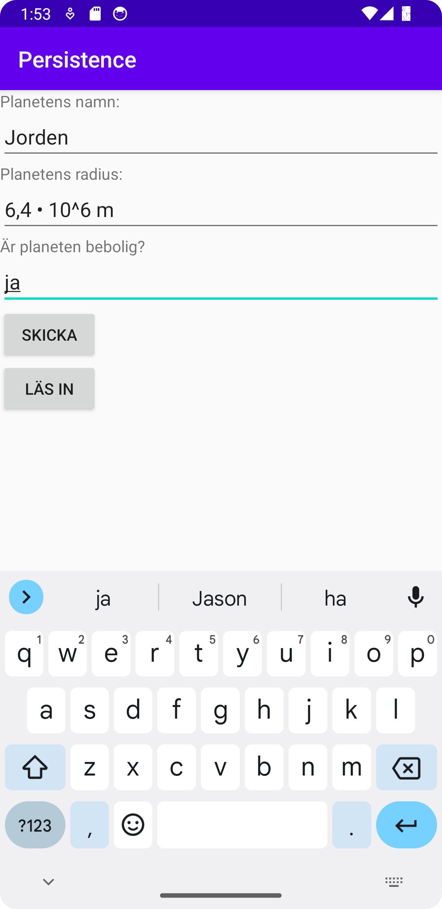
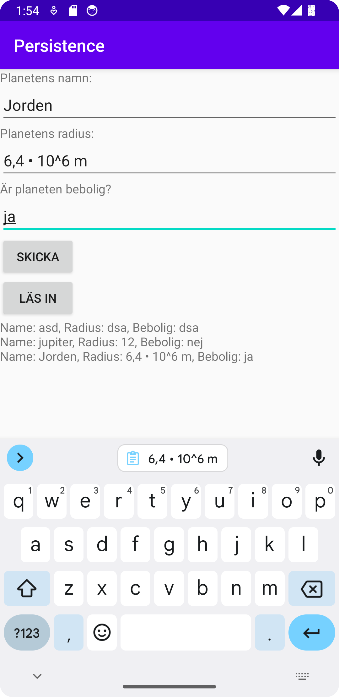

# Rapport
Projektet startades med att lägga till views i layouten. Tre stycken editviews lades till med varsin Textview som beskrev vad som ska vara i editviewen. Sedan lades två buttons till, en för write och en för read, och en textview som ska visa sql-texten.  
Sedan skapades två klasser. Den ena heter DatabaseTables och hanterar tables i sqlite. Då det valdes att projektet ska lagra planeter med namn, radius och bebobar status, så beskrivs det i den klassen hur en sådan table med planeter ska se ut. I den klassen finns även metoder för att lägga till och ta bort planeter från sqlite-filen.   
Den andra klassen heter DatabaseHelper och i den så beskrivs det vad sqlite-filen heter och att appen ska exekvera och använda den filen när appen startar.  
I MainActivity.java sen så identifieras de två knapparna och de får varsinn onclicklistener som gör att det sker något när de trycks in. I knappen buttonWrites clicklistener identifieras alla tre edittext views och skickas vidare till metoden addPlanet. I addPlanet så tar den de tre stringsen (namn, radius, habitable) och gör en database insert i databasen med hjälp av DatabaseTables-klassen och DatabaseHelper-klassen.  
I den andra knappens(buttonRead) clicklistener så skapar den en list med Strings som är lika med metoden getPlanets. I getPlanets cursor för att titta igenom databasen rad för rad och hämta ut de värden som är intressanta. Listan planets som gavs av metoden innehåller då varje planet som har lagts till men i string-format, så därefter finns en for-loop som lägger på alla strings efter varandra med ett "\n" mellan varje så att det finns radbryte mellan raderna. Till sist sätts denna rad med strängar till TextViewen som var längst ned så att alla planeter visas.  
# Kod
```
    private List<String> getPlanets() {
        Cursor cursor = database.query(DatabaseTables.Planet.TABLE_NAME, new String[] {
                DatabaseTables.Planet.COLUMN_NAME_ID,
                DatabaseTables.Planet.COLUMN_NAME_NAME,
                DatabaseTables.Planet.COLUMN_NAME_RADIUS,
                DatabaseTables.Planet.COLUMN_NAME_HABITABLE
        }, null, null, null, null, null);
        List<String> planets = new ArrayList<>();
        while (cursor.moveToNext()) {
            String id = cursor.getString(cursor.getColumnIndexOrThrow(DatabaseTables.Planet.COLUMN_NAME_ID));
            String name = cursor.getString(cursor.getColumnIndexOrThrow(DatabaseTables.Planet.COLUMN_NAME_NAME));
            String radius = cursor.getString(cursor.getColumnIndexOrThrow(DatabaseTables.Planet.COLUMN_NAME_RADIUS));
            String habitable = cursor.getString(cursor.getColumnIndexOrThrow(DatabaseTables.Planet.COLUMN_NAME_HABITABLE));
            planets.add(String.format("Name: %s, Radius: %s, Bebolig: %s", name, radius, habitable));
        }
        cursor.close();
        return planets;
    }
```
Kod som beskriver hur datan om varje planet i sqlite-filen hämtas. Först sätts en cursor till planeterna som finns i databasen, sedan skapas en tom Arraylist, därefter går cursorn igenom tabellerna i databasen och konstruerar strings med hjälp av datan som den hittar och lägger till det i ArrayListen som strings. Slutligen returnas ArrayList:en.
# Bilder


